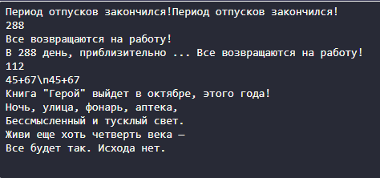

# Отчет по первой лабораторной работе

1. [Инструкции по запуску проекта](#1-инструкции-по-запуску-проекта).
2. [Описание проекта](#2-описание-проекта).
3. [Краткая документация к проекту](#3-краткая-документация-к-проекту).
4. [Примеры использования проекта с приложением скриншотов или фрагментов кода](#4-пример-использования-проекта-с-приложением-скриншотов).
5. [Список использованных источников](#5-список-использованных-источников).

## 1. Инструкции по запуску проекта
Данные инструкции действительны при использовании PhpStorm, в ином случае, воспользуйтесь приведенной ссылкой:
[запуск проекта с gitHub](https://www.youtube.com/watch?v=6N6JFynR0gM)

1. Клонируйте репозиторий:
   ```bash
   https://github.com/Artiom9/php_labs.git
2. Запустите проект:  
   <!-- Если у вас есть веб-сервер (например, Apache или Nginx), настройте его так, чтобы корневой каталог указывал на
   каталог вашего проекта.  
   Если у вас нет веб-сервера, вы можете использовать встроенный сервер PHP для тестирования: -->
   ```bash 
   php -S localhost:8000 lab_1\lab1.php

## 2. Описание проекта

Лабораторная работа представляет собой PHP-скрипт, который отображает определенные сообщения на экране. В ходе выполнения скрипта используются разные методы вывода текста, такие как echo, print, а также heredoc для работы с многострочным текстом. Основное внимание уделяется работе с переменными, в том числе вложенными выражениями в строках, а также выполнению арифметических операций. Проект включает примеры использования различных возможностей языка PHP для манипуляций с текстом и управления переменными.

## 3. Краткая документация к проекту

#### Вывод на экран "Период отпусков закончился!" с использованием echo и print.

```php
<?php
echo "Период отпусков закончился!";
print "Период отпусков закончился!";
```

#### Вывод значений переменных на экран, каждую с новой строки.

```php
<?php
$integerVariable = 288;
$stringVariable = "Все возвращаются на работу!";
echo '<br />' . $integerVariable;
echo '<br />' . $stringVariable;
```

#### Вывод строки, состоящей из значения первой переменной в конкатенации со второй.

```php
<?php
echo "<br />В $integerVariable день, приблизительно ... $stringVariable";
```

#### Вывод суммы чисел 45+67 и эксперименты с разными синтаксисами.

```php
<?php
echo '<br />' . (45 + 67);
echo '<br />' . "45+67";
echo '<br />' . '45+67';
```

#### Вывод предложения с использованием правильных кавычек.

```php
<?php
echo '<br />Книга "Герой" выйдет в октябре, этого года!';
```

#### Добавление стиха и его вывод.

```php
<?php
$poem = "<br />Розы красные,
<br />Фиалки синие,
<br />Стихи — это прекрасно,
<br />Как и ваша улыбка веселая!";
echo $poem;
```
## 3.1 Весь код будет выглядеть так
```php
<?php
// Базовый PHP скрипт для демонстрации различных операций

// Выводим строку с использованием echo и print
echo "Период отпусков закончился!";
print "Период отпусков закончился!";

// Объявляем переменные
$days = 288; // Целочисленная переменная
$message = "Все возвращаются на работу!"; // Строковая переменная

// Выводим значения переменных, каждое с новой строки
echo "\n" . $days;
echo "\n" . $message;

// Конкатенация строк и переменных для формирования сообщения
echo "\nВ " . $days . " день, приблизительно ... " . $message;

// Вывод суммы чисел с использованием разных подходов
echo "\n" . (45 + 67); // Результатом будет 112
echo "\n45+67"; // Выводит строку "45+67"
echo '\n45+67'; // Выводит строку "\n45+67", \n не интерпретируется как новая строка

// Вывод предложения с кавычками
echo "\nКнига \"Герой\" выйдет в октябре, этого года!";

// Добавление стиха с правильным форматированием вывода
$poem = "Ночь, улица, фонарь, аптека,\nБессмысленный и тусклый свет.\nЖиви еще хоть четверть века —\nВсе будет так. Исхода нет.\n";
echo "\n" . $poem;

// Комментарии добавлены для объяснения каждого шага
?>
```
## 4. Пример использования проекта (с приложением скриншотов)



## 5. Список использованных источников

1. [Функции в PHP](https://www.php.net/manual/ru/functions.user-defined.php)
