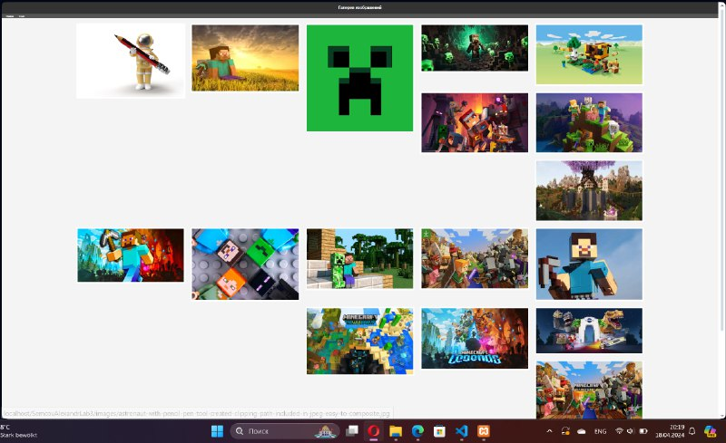

# Отчет по второй лабораторной работе

1. [Инструкции по запуску проекта](#1-инструкции-по-запуску-проекта).
2. [Описание проекта](#2-описание-проекта).
3. [Краткая документация к проекту](#3-краткая-документация-к-проекту).
4. [Примеры использования проекта с приложением скриншотов или фрагментов кода](#4-пример-использования-проекта-с-приложением-скриншотов).
5. [Список использованных источников](#5-список-использованных-источников).

## 1. Инструкции по запуску проекта

Данные инструкции действительны при использовании PhpStorm, в ином случае, воспользуйтесь приведенной ссылкой:
[запуск проекта с gitHub](https://www.youtube.com/watch?v=6N6JFynR0gM)

1. Клонируйте репозиторий:
   ```bash
   https://github.com/MegaImboba/phplab.git
2. Запустите проект:
   <!-- Если у вас есть веб-сервер (например, Apache или Nginx), настройте его так, чтобы корневой каталог указывал на
   каталог вашего проекта.  
   Если у вас нет веб-сервера, вы можете использовать встроенный сервер PHP для тестирования: -->
   ```bash 
   php -S localhost:8000 \SemcovAlexandrLab3\lab3.php

## 2. Описание проекта

В данной лабораторной работе мы займёмся созданием динамической галереи изображений с использованием PHP. Главной задачей является разработка PHP-скрипта, который будет автоматически сканировать заданные директории на сервере для поиска изображений и формировать из них галерею прямо на веб-странице.

## 3. Краткая документация к проекту

#### HTML страница

```html
    <meta charset="UTF-8">
    <meta name="viewport" content="width=device-width, initial-scale=1.0">
    <title>Галерея изображений</title>
    <style>
        body { font-family: Arial, sans-serif; margin: 0; padding: 0; background: #f4f4f4; color: #333; }
        header, footer { background: #333; color: #fff; padding: 10px 20px; text-align: center; }
        nav { background: #555; padding: 10px 20px; }
        nav a { color: white; text-decoration: none; padding: 10px 15px; }
        .container { width: 80%; margin: 20px auto; overflow: auto; }
        .image { float: left; width: 19%; margin: 0.5%; background: white; padding: 10px; box-sizing: border-box; }
        .image img { width: 100%; height: auto; }
        @media (max-width: 600px) {
            .image { width: 49%; }
        }
    </style>
```

#### Php код для выполнения условий и вывода изображения

1. Для xx-xx
```php
        <?php
        $dir = 'image/';  
        $files = scandir($dir);
        if ($files !== false) {
            for ($i = 0; $i < count($files); $i++) {
                if ($files[$i] != "." && $files[$i] != "..") {
                    $path = $dir . $files[$i];
                    echo "<div class='image'><a href='$path'></a></div>";
                }
            }
        } else {
            echo "<p>Не удалось загрузить изображения.</p>";
        }
        ?>
```
## 3.1 Код полностью
```php
<!DOCTYPE html>
<head>
    <meta charset="UTF-8">
    <meta name="viewport" content="width=device-width, initial-scale=1.0">
    <title>Галерея изображений</title>
    <style>
        body { font-family: Arial, sans-serif; margin: 0; padding: 0; background: #f4f4f4; color: #333; }
        header, footer { background: #333; color: #fff; padding: 10px 20px; text-align: center; }
        nav { background: #555; padding: 10px 20px; }
        nav a { color: white; text-decoration: none; padding: 10px 15px; }
        .container { width: 80%; margin: 20px auto; overflow: auto; }
        .image { float: left; width: 19%; margin: 0.5%; background: white; padding: 10px; box-sizing: border-box; }
        .image img { width: 100%; height: auto; }
        @media (max-width: 600px) {
            .image { width: 49%; }
        }
    </style>
</head>
<body>
    <header>
        <h1>Галерея изображений</h1>
    </header>
    <nav>
        <a href="/">Главная</a> | <a href="/about">О нас</a>
    </nav>
    <div class="container">
        <?php
        $dir = 'image/';  
        $files = scandir($dir);
        if ($files !== false) {
            for ($i = 0; $i < count($files); $i++) {
                if ($files[$i] != "." && $files[$i] != "..") {
                    $path = $dir . $files[$i];
                    echo "<div class='image'><a href='$path'></a></div>";
                }
            }
        } else {
            echo "<p>Не удалось загрузить изображения.</p>";
        }
        ?>
    </div>
    <footer>
        <p>&copy; 2024 Ваша компания</p>
    </footer>
</body>
</html>


```

## 4. Пример использования проекта (с приложением скриншотов)



## 5. Список использованных источников

1. [Функции в PHP](https://www.php.net/manual/ru/functions.user-defined.php)

