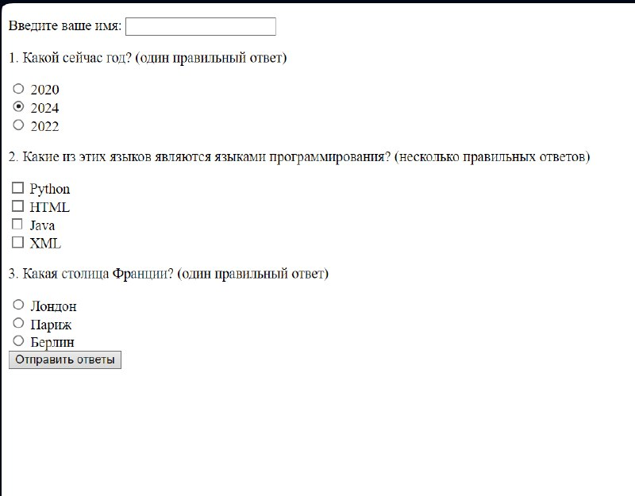

# Отчет по второй лабораторной работе

1. [Инструкции по запуску проекта](#1-инструкции-по-запуску-проекта).
2. [Описание проекта](#2-описание-проекта).
3. [Краткая документация к проекту](#3-краткая-документация-к-проекту).
4. [Примеры использования проекта с приложением скриншотов или фрагментов кода](#4-пример-использования-проекта-с-приложением-скриншотов).
5. [Список использованных источников](#5-список-использованных-источников).

## 1. Инструкции по запуску проекта

Данные инструкции действительны при использовании PhpStorm, в ином случае, воспользуйтесь приведенной ссылкой:
[запуск проекта с gitHub](https://www.youtube.com/watch?v=6N6JFynR0gM)

1. Клонируйте репозиторий:
   ```bash
   https://github.com/MegaImboba/phplab.git
2. Запустите проект:
   <!-- Если у вас есть веб-сервер (например, Apache или Nginx), настройте его так, чтобы корневой каталог указывал на
   каталог вашего проекта.  
   Если у вас нет веб-сервера, вы можете использовать встроенный сервер PHP для тестирования: -->
   ```bash 
   php -S localhost:8000 \SemcovAlexandrLab4\lab4.php

## 2. Описание проекта

Создание интерактивного теста на PHP с использованием HTML-формы, в которой пользователи могут выбирать ответы с помощью радиокнопок и чекбоксов, можно следовать следующему шаблону. 

## 3. Форма для обработки (php, принимает и обрабатывает форму)
```html
    <form action="" method="post">
        <p>Введите ваше имя: <input type="text" name="name" required></p>
        
        <p>1. Какой сейчас год? (один правильный ответ)</p>
        <input type="radio" name="question1" value="1"> 2020<br>
        <input type="radio" name="question1" value="2"> 2023<br>
        <input type="radio" name="question1" value="3"> 2022<br>

        <p>2. Какие из этих языков являются языками программирования? (несколько правильных ответов)</p>
        <input type="checkbox" name="question2[]" value="a"> Python<br>
        <input type="checkbox" name="question2[]" value="b"> HTML<br>
        <input type="checkbox" name="question2[]" value="c"> Java<br>
        <input type="checkbox" name="question2[]" value="d"> XML<br>

        <p>3. Какая столица Франции? (один правильный ответ)</p>
        <input type="radio" name="question3" value="a"> Лондон<br>
        <input type="radio" name="question3" value="b"> Париж<br>
        <input type="radio" name="question3" value="c"> Берлин<br>

        <input type="submit" value="Отправить ответы">
    </form>
```
#### Php код который смотрит правильность выполнения теста

```php
   <?php
    if ($_SERVER["REQUEST_METHOD"] == "POST") {
        $name = $_POST['name'];
        $score = 0;

        // Вопрос 1
        $answer1 = $_POST['question1'];
        if ($answer1 == "2") { // Предполагаем, что правильный ответ - это вариант 2
            $score++;
        }

        // Вопрос 2
        $answer2 = isset($_POST['question2']) ? $_POST['question2'] : [];
        $correctAnswers2 = ["a", "c"]; // Правильные ответы
        if ($answer2 == $correctAnswers2) {
            $score++;
        }

        // Вопрос 3
        $answer3 = $_POST['question3'];
        if ($answer3 == "b") { // Предполагаем, что правильный ответ - это вариант b
            $score++;
        }

        echo "<h3>Результаты теста для $name</h3>";
        echo "<p>Вы ответили правильно на $score из 3 вопросов.</p>";
    } else {
    ?>
```
## 3.1 Код полностью
```php
<!DOCTYPE html>
<html lang="ru">
<head>
    <meta charset="UTF-8">
    <title>Простой тест</title>
</head>
<body>
    <?php
    if ($_SERVER["REQUEST_METHOD"] == "POST") {
        $name = $_POST['name'];
        $score = 0;

        // Вопрос 1
        $answer1 = $_POST['question1'];
        if ($answer1 == "2") { // Предполагаем, что правильный ответ - это вариант 2
            $score++;
        }

        // Вопрос 2
        $answer2 = isset($_POST['question2']) ? $_POST['question2'] : [];
        $correctAnswers2 = ["a", "c"]; // Правильные ответы
        if ($answer2 == $correctAnswers2) {
            $score++;
        }

        // Вопрос 3
        $answer3 = $_POST['question3'];
        if ($answer3 == "b") { // Предполагаем, что правильный ответ - это вариант b
            $score++;
        }

        echo "<h3>Результаты теста для $name</h3>";
        echo "<p>Вы ответили правильно на $score из 3 вопросов.</p>";
    } else {
    ?>
    <form action="" method="post">
        <p>Введите ваше имя: <input type="text" name="name" required></p>
        
        <p>1. Какой сейчас год? (один правильный ответ)</p>
        <input type="radio" name="question1" value="1"> 2020<br>
        <input type="radio" name="question1" value="2"> 2023<br>
        <input type="radio" name="question1" value="3"> 2022<br>

        <p>2. Какие из этих языков являются языками программирования? (несколько правильных ответов)</p>
        <input type="checkbox" name="question2[]" value="a"> Python<br>
        <input type="checkbox" name="question2[]" value="b"> HTML<br>
        <input type="checkbox" name="question2[]" value="c"> Java<br>
        <input type="checkbox" name="question2[]" value="d"> XML<br>

        <p>3. Какая столица Франции? (один правильный ответ)</p>
        <input type="radio" name="question3" value="a"> Лондон<br>
        <input type="radio" name="question3" value="b"> Париж<br>
        <input type="radio" name="question3" value="c"> Берлин<br>

        <input type="submit" value="Отправить ответы">
    </form>
    <?php
    }
    ?>
</body>
</html>
```

## 4. Пример использования проекта (с приложением скриншотов)

(sample.png)

## 5. Список использованных источников

1. [Функции в PHP](https://www.php.net/manual/ru/functions.user-defined.php)

