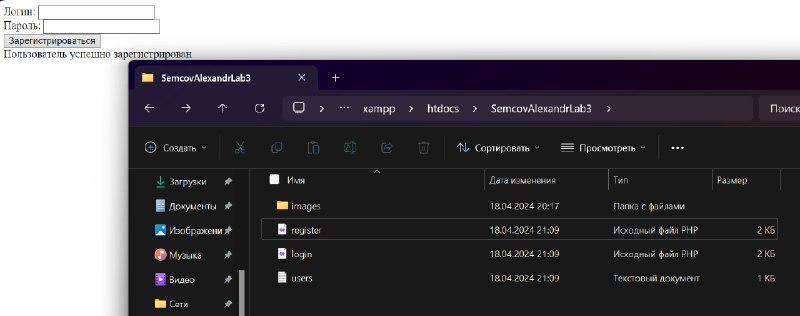
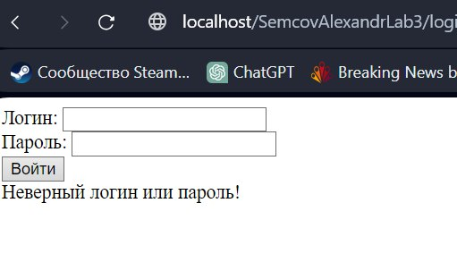
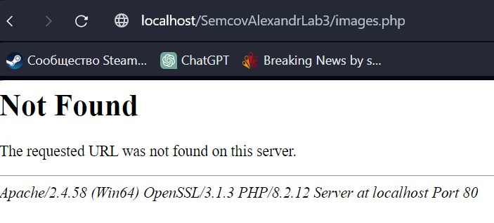
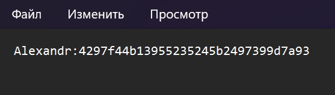

# Отчет по второй лабораторной работе

1. [Инструкции по запуску проекта](#1-инструкции-по-запуску-проекта).
2. [Описание проекта](#2-описание-проекта).
3. [Краткая документация к проекту](#3-краткая-документация-к-проекту).
4. [Примеры использования проекта с приложением скриншотов или фрагментов кода](#4-пример-использования-проекта-с-приложением-скриншотов).
5. [Список использованных источников](#5-список-использованных-источников).

## 1. Инструкции по запуску проекта

Данные инструкции действительны при использовании PhpStorm, в ином случае, воспользуйтесь приведенной ссылкой:
[запуск проекта с gitHub](https://www.youtube.com/watch?v=6N6JFynR0gM)

1. Клонируйте репозиторий:
   ```bash
   https://github.com/MegaImboba/phplab.git
2. Запустите проект:
   <!-- Если у вас есть веб-сервер (например, Apache или Nginx), настройте его так, чтобы корневой каталог указывал на
   каталог вашего проекта.  
   Если у вас нет веб-сервера, вы можете использовать встроенный сервер PHP для тестирования: -->
   ```bash 
   php -S localhost:8000 \SemcovAlexandrLab5\lab5.php

## 2. Описание проекта

Разработать две формы и соответствующие PHP-скрипты для регистрации и авторизации пользователя. 

## 3.1 Форма для регистрации (php, принимает и обрабатывает форму)
```html
    <form action="register.php" method="post"> 
        <label for="login">Логин:</label> 
        <input type="text" id="login" name="login" required><br> 
        <label for="password">Пароль:</label> 
        <input type="password" id="password" name="password" required><br> 
        <input type="submit" value="Зарегистрироваться"> 
    </form> 
```
#### Php код отвечает за регистрацию
Если пользователь успешно регистрируется то благодаря функции http_response_code мы отправляем HTTP-201 код
А также записываем данные о логине в users.txt
$hashedPassword = md5($_POST["password"]); Хэширует пароль согласно алгоритму md5
```php
<?php 
if ($_SERVER["REQUEST_METHOD"] == "POST") { 
    if (!empty($_POST["login"]) && !empty($_POST["password"])) { 
        // Шифрование пароля 
        $hashedPassword = md5($_POST["password"]); 
        // Сохранение данных в файл 
        $file = fopen("users.txt", "a"); 
        fwrite($file, $_POST["login"] . ":" . $hashedPassword . PHP_EOL); 
        fclose($file); 
        // Отправка HTTP-кода 201 Created 
        http_response_code(201); 
        echo "Пользователь успешно зарегистрирован"; 
    } else { 
        http_response_code(400); 
        echo "Заполните все поля!"; 
    } 
} else { 
    http_response_code(405); 
    echo "Недопустимый метод запроса"; 
} 
?>
```
## 3.1.1 Код полностью
```php
<!DOCTYPE html> 
<html lang="ru"> 
<head> 
    <meta charset="UTF-8"> 
    <title>Регистрация</title> 
</head> 
<body> 
    <form action="register.php" method="post"> 
        <label for="login">Логин:</label> 
        <input type="text" id="login" name="login" required><br> 
        <label for="password">Пароль:</label> 
        <input type="password" id="password" name="password" required><br> 
        <input type="submit" value="Зарегистрироваться"> 
    </form> 
</body> 
</html>
<?php 
if ($_SERVER["REQUEST_METHOD"] == "POST") { 
    if (!empty($_POST["login"]) && !empty($_POST["password"])) { 
        // Шифрование пароля 
        $hashedPassword = md5($_POST["password"]); 
        // Сохранение данных в файл 
        $file = fopen("users.txt", "a"); 
        fwrite($file, $_POST["login"] . ":" . $hashedPassword . PHP_EOL); 
        fclose($file); 
        // Отправка HTTP-кода 201 Created 
        http_response_code(201); 
        echo "Пользователь успешно зарегистрирован"; 
    } else { 
        http_response_code(400); 
        echo "Заполните все поля!"; 
    } 
} else { 
    http_response_code(405); 
    echo "Недопустимый метод запроса"; 
} 
?>
```
## 4.1 Форма для Логина (php, принимает и обрабатывает форму)
```html
    <form action="login.php" method="post"> 
        <label for="login">Логин:</label> 
        <input type="text" id="login" name="login" required><br> 
        <label for="password">Пароль:</label> 
        <input type="password" id="password" name="password" required><br> 
        <input type="submit" value="Войти"> 
    </form> 
```
#### Php код отвечает за логин
Сервер получает информацию о Логине и пароле , и если информация отправленна корректно он проверяет есть ли логин и пароль в системе(users.txt)
если есть то он отправляет на images.php (код с изображением), если данные неверные,то начинается обработка ошибок,
будь то неверный логин или пароль, или незаполненные поля, или недопустимый метод запроса
```php
<?php 
if ($_SERVER["REQUEST_METHOD"] == "POST") { 
    if (!empty($_POST["login"]) && !empty($_POST["password"])) { 
        $hashedPassword = md5($_POST["password"]); 
        $userData = $_POST["login"] . ":" . $hashedPassword; 
 
        // Проверяем наличие пользователя в файле 
        $isValid = false; 
        $file = fopen("users.txt", "r"); 
        while ($line = fgets($file)) { 
            if (trim($line) == $userData) { 
                $isValid = true; 
                break; 
            } 
        } 
        fclose($file); 
 
        if ($isValid) { 
            // Перенаправление на страницу с изображениями 
            header("Location: images.php"); 
            exit; 
        } else { 
            echo "Неверный логин или пароль!"; 
        } 
    } else { 
        echo "Заполните все поля!"; 
    } 
} else { 
    echo "Недопустимый метод запроса"; 
} 
?>
```
## 3.1.1 Код полностью
```php
<!DOCTYPE html> 
<html lang="ru"> 
<head> 
    <meta charset="UTF-8"> 
    <title>Авторизация</title> 
</head> 
<body> 
    <form action="login.php" method="post"> 
        <label for="login">Логин:</label> 
        <input type="text" id="login" name="login" required><br> 
        <label for="password">Пароль:</label> 
        <input type="password" id="password" name="password" required><br> 
        <input type="submit" value="Войти"> 
    </form> 
</body> 
</html>
<?php 
if ($_SERVER["REQUEST_METHOD"] == "POST") { 
    if (!empty($_POST["login"]) && !empty($_POST["password"])) { 
        $hashedPassword = md5($_POST["password"]); 
        $userData = $_POST["login"] . ":" . $hashedPassword; 
 
        // Проверяем наличие пользователя в файле 
        $isValid = false; 
        $file = fopen("users.txt", "r"); 
        while ($line = fgets($file)) { 
            if (trim($line) == $userData) { 
                $isValid = true; 
                break; 
            } 
        } 
        fclose($file); 
 
        if ($isValid) { 
            // Перенаправление на страницу с изображениями 
            header("Location: images.php"); 
            exit; 
        } else { 
            echo "Неверный логин или пароль!"; 
        } 
    } else { 
        echo "Заполните все поля!"; 
    } 
} else { 
    echo "Недопустимый метод запроса"; 
} 
?>

```
## 4. Пример использования проекта (с приложением скриншотов)



## 5. Список использованных источников

1. [Функции в PHP](https://www.php.net/manual/ru/functions.user-defined.php)


